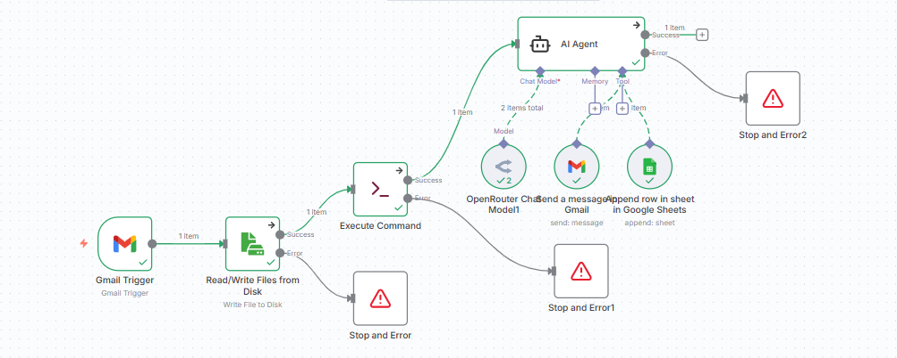

# 💰 FinanceBot – Automated Invoice Data Extraction System (n8n + LangChain + Google Sheets)

This workflow automates financial document processing using **n8n**, **LangChain AI**, and **Google Sheets** — reducing manual data entry and ensuring accuracy.

---

## 🚀 Features

✅ Automatically triggers on new invoice emails (via Gmail)  
✅ Extracts data fields using **LangChain AI Agent (OpenRouter model)**  
✅ Parses PDFs using **Poppler (pdftotext)**  
✅ Saves results to **Google Sheets** for tracking  
✅ Sends operation status updates via Gmail  
✅ Includes robust error handling for reliability  

---

## ⚙️ Workflow Overview

**Gmail Trigger → File Save → Poppler (pdftotext) → LangChain AI → Google Sheets → Gmail Notification**

<h2 align="center">🧭 Workflow Diagram</h2>

  

---

## 🎥 Demo Video

  <video src="demo.mp4" width="700" controls></video>

  ▶️ <a href="https://github.com/muhammadmusabyaqoob/FinanceBot-n8n/blob/main/demo.mp4?raw=true">Click here to view the video</a>

---

## 🧩 Tech Stack

- **n8n** – Workflow automation  
- **LangChain (OpenRouter)** – AI-based data extraction  
- **Poppler (pdftotext)** – PDF text conversion  
- **Google Sheets API** – Data storage  
- **Gmail API** – Email trigger and notifications  

---

## 🧠 Key Highlights

- Extracts six fields: *Supplier Name, Order Date, Order Number, Supplier Email, Total Amount, Currency*  
- AI agent ensures consistent and accurate extraction  
- Real-time updates in Google Sheets  
- Email confirmation after each process  
- Fault-tolerant design with error-handling nodes  

---

## 📧 Example Output

**Email Trigger:** `New Invoice from ABC Traders`  

**Extracted Data Example:**
| Supplier Name | Order Date | Order Number | Total | Currency |
|----------------|-------------|---------------|--------|-----------|
| ABC Traders | 2025-10-20 | INV-321 | 1,250 | USD |

---

## 🧑‍💻 Author

**Muhammad Musab**  
AI Engineer Intern @ Solutyics  
🌐 [GitHub Profile](https://github.com/muhammadmusabyaqoob)

---

## 🏷️ Tags

`n8n` `LangChain` `OpenRouter` `Poppler` `Google Sheets` `AI` `Automation` `FinanceBot`

---

## 🌟 Badges

